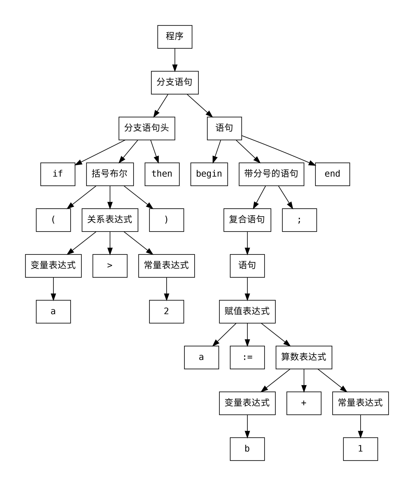

# 编译原理课程设计

使用Bison和Flex实现一个简单的编译器，将源代码翻译成四元式。


## 编译

**下载Bison和flex**

```bash
sudo apt install bison flex
```

**编译**

```bash
make
```

## 使用

可执行文件名是 my\_compiler，执行时有两个参数:

1. `-t` 用来生成抽象语法树
2. `-c` 用来生成四元式

所有输入默认以标准输入流方式读入，在实际使用中可以使用重定向或者管道来将文件中 的字符串输入程序，输入默认也是向标准输出流输出，同样可以使用重定向来将输出结果保存 到文件。下面是一个简短的例子:

编写源文件`a.txt`如下:

```
if (a > 2) then 
begin
  a := b + 1;
end
```

```bash
./my_compiler -c < a.txt
  1|  :=,    2,    -,   t0 |
  2|  j>,    a,   t0,    4 |
  3| jmp,    -,    -,    7 |
  4|  :=,    1,    -,   t1 |
  5|   +,    b,   t1,   t2 |
  6|  :=,   t2,    -,    a |
# 通过重定向保存到文件 
./my_compiler -c < a.txt > b.txt
```

同样使用-t 选项可以为源文件生成另一种中间代码表示形式，也就是抽象语法树，使用方法如下：


```bash
./my_compiler -t < a.txt
digraph AST {
        node [fontname = Consolas, shape = box]
        edge [fontname = Consolas]
        0 [label="if"]
        11 -> 0
        1 [label="("]
        ......
# 通过重定向保存到文件        
./my_compiler -t < a.txt > b.dot
```

可以看到我使用了 dot 格式来保存抽象语法树，你可以下载 graphviz 来将 dot 文件转换成 pdf 或者 png 格式的可视化文件。使用 `dot -Tpdf b.dot -o b.pdf` 指令将 dot 文件 编译成 pdf 格式，然后你就会看到下面的抽象语法树了。



